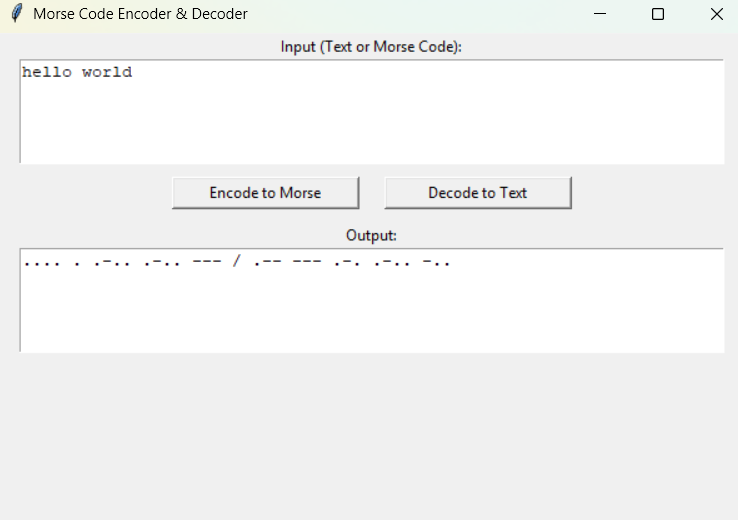

# Morse Code Translator 🔤

A simple Python project to encode English text to Morse code and decode Morse code back to English.  
Built with a user-friendly **Tkinter GUI**, this project is great for beginners learning Python and GUI programming.

---

## 🚀 Features

- 🔡 Encode text to Morse code
- 🕵️ Decode Morse code to text
- 🪟 Clean graphical interface (Tkinter)
- 📦 Simple, beginner-friendly Python project

---

## 🖼️ GUI Preview



---

## 🧑‍💻 How to Run

1. Clone the repository:
   ```bash
   git clone https://github.com/0xroot-suraj/morse-code-translator.git
   cd morse-code-translator
   ```

2. Run the script:
   ```bash
   python main.py
   ```

---

## 📂 File Structure

```
morse-code-translator/
├── main.py           # Main Python GUI app
├── README.md         # You're reading it!
├── .gitignore        # Python ignores
└── LICENSE           # MIT License
```

---

## ⚖️ License

This project is licensed under the [MIT License](LICENSE).

---

## ✍️ Author

**Shakti Suraj Mohapatra**  
> Beginner Python developer learning by building cool stuff.

---

## 📬 Contact

Feel free to reach out via GitHub issues or discussions if you have suggestions or feedback!
